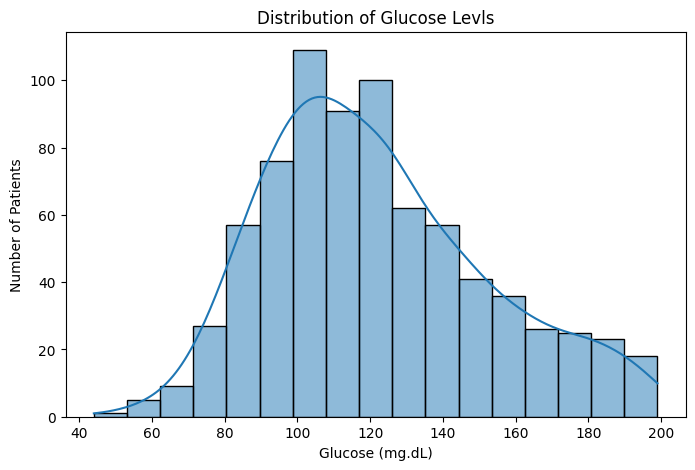
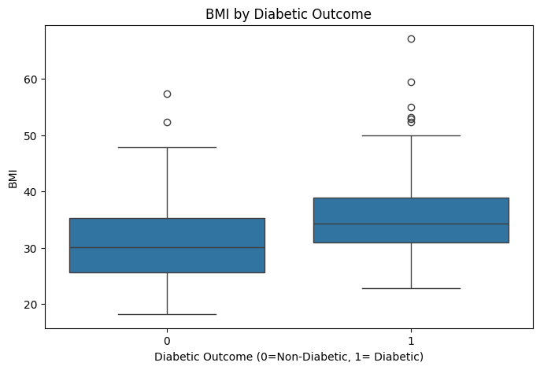

# 🩺 Diabetes Health Data Analysis — Python Project

## 📘 Overview
This project explores a healthcare dataset focusing on **diabetes-related factors** such as glucose levels, BMI, blood pressure, insulin, pregnancies, and outcomes.  

The goal was to uncover trends and correlations that could help understand **patient risk patterns, clinical outcomes, and possible health interventions** — all using **Python** for data analysis and visualization.  

Through this analysis, I applied **feature engineering**, **exploratory visual analysis**, and **clinical risk grouping** to transform raw numbers into actionable insights.  

---

## 🧰 Tools Used
- **Python 3** – programming language  
- **Jupyter Notebook** – interactive coding and analysis  
- **pandas & numpy** – data manipulation and cleaning  
- **matplotlib & seaborn** – visual exploration and plotting  
- **GitHub** – for documentation, version control, and portfolio showcase  

---

## 🧹 Step 1: Data Cleaning
Imported the `diabetes.csv` dataset and prepared it for analysis.  

- Replaced zero values in physiologically impossible columns (`Glucose`, `BloodPressure`, `SkinThickness`, `Insulin`, `BMI`) with `NaN` for accurate calculations.  
- Ensured column names were correct and ready for analysis.  

---

## 📊 Step 2: Outcome Distribution
Explored how many patients were classified as diabetic (`1`) or non-diabetic (`0`).  

- This provides a **baseline overview** of the dataset.  

---

## 📈 Step 3: Glucose Level Distribution
Grouped plasma glucose values into clinical **buckets** and calculated **both counts and diabetic percentages**.  

- Revealed how **higher glucose levels correspond to increased diabetes prevalence**.  
- Noted that some patients with **lower glucose (<100 and 100–125 mg/dL)** were still diabetic, showing **real-world variability in diagnosis**.  

🖼️ *Visualization:*  

---

## ⚖️ Step 4: BMI Categories and Outcomes
Categorized BMI into clinical ranges and analyzed diabetes prevalence within each category:  

- **Normal:** BMI <25  
- **Overweight:** 25 ≤ BMI <30  
- **Obese:** BMI ≥30  

Findings:  
- Diabetes prevalence increases progressively from normal to obese.  
- Obese group shows the **highest diabetic percentage**, aligning with epidemiological trends.  

🖼️ *Visualization:*  

---

## 💓 Step 5: Blood Pressure Analysis
Categorized **systolic blood pressure** into risk levels:  

- Normal, Elevated, High  
- Explored associations with diabetes outcome  

Findings:  
- Alone, blood pressure is less predictive, but when combined with glucose and BMI into a **clinical risk group**, patterns become clear.  

🖼️ *Visualization:*  

---

## 🧩 Step 6: Clinical Risk Groups
Created a **composite clinical risk feature** based on **glucose, BMI, and blood pressure**:  

- **Low Risk:** All variables normal  
- **Medium Risk:** One elevated indicator  
- **High Risk:** Multiple elevated indicators  

This allowed a **multi-variable analysis** of patient risk patterns and clarified which groups were more likely to be diabetic.  

🖼️ *Visualization:*  

---

## 🖼️ Step 7: Correlation Heatmap
Generated a heatmap to visualize **inter-variable relationships**:  

- Highlighted strong correlations between **glucose and outcome**, **BMI and outcome**, and moderate correlations with blood pressure.  

🖼️ *Visualization:*  

---

## 🧮 Step 8: Summary Tables
Calculated **percentage of diabetics** within:  

- Glucose buckets  
- BMI categories  
- Clinical risk groups  

| Feature | Observation |
|---------|------------|
| Glucose | Higher ranges have higher diabetic percentages, but pre-diabetic range still shows diagnosed cases |
| BMI | Obese category has the highest prevalence of diabetes |
| Risk Group | High-risk group most predictive, but medium risk shows early warning signs |

---

## 🧠 Step 9: Key Insights
- **Glucose is the strongest single indicator** of diabetes prevalence.  
- **BMI contributes significantly**, especially in combination with elevated glucose.  
- **Clinical Risk Grouping** reveals cumulative risk patterns not apparent from single variables.  
- **Visual analysis confirms trends**, showing how Python allows quick exploration and interpretation of complex healthcare data.  

---

## 👩🏾‍🔬 About the Author
**Nontuthuko Nsele**  
Biomedical Scientist | Aspiring Clinical Data Analyst  
Passionate about health research, data analytics, and improving patient outcomes.  
🔗 [LinkedIn](https://linkedin.com/in/nontuthuko-nsele-50173012a)
