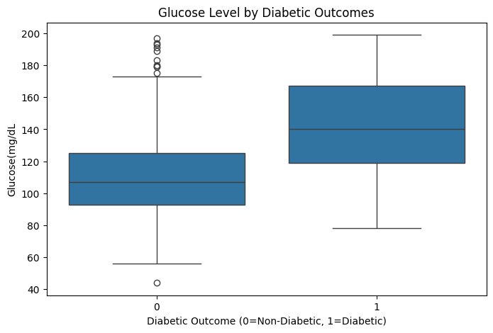

# Diabetes Health Data Analysis (Python)

## Project Overview
This project explores clinical and demographic factors associated with diabetes outcomes using a combined **SQL and Python workflow**. The goal is to identify metabolic risk patterns through feature engineering, exploratory data analysis, and summary statistics.

This notebook complements a SQL-based analysis I conducted, allowing me to visualize trends and summarize patterns more clearly. The idea was to translate the tabular insights from SQL into interpretable Python visualizations, which can guide clinical interpretation and decision-making.

---

## Tools & Technologies
- Python (pandas, matplotlib, seaborn)
- Jupyter Notebook
---

## Dataset
Patient-level health indicators including:
- Glucose
- BMI
- Blood Pressure
- Age
- Pregnancies
- Diabetes Outcome

---

## Analysis Workflow

### 1️⃣ SQL Analysis
- Aggregations and group-based summaries
- Outcome comparisons across clinical variables
- Early risk identification

[View thr SQL Reort here](https://github.com/NseleAnalytics/Diabetes_Health_Data_Analysis)

### 2️⃣ Python Analysis
- Feature engineering: glucose, BMI, blood pressure categories
- Clinical risk group construction
- Visual exploratory data analysis
- Percentage-based summary tables

---

## Key Visualizations

### 1. Glucose Distribution
Histogram showing the overall distribution of glucose levels in the dataset.  
We can see most individuals are in the normal to prediabetic range, with a smaller group at higher glucose levels.

---

### 2. Glucose vs Diabetes Outcome
Boxplot comparing glucose levels across diabetes outcomes.  
The median and interquartile range are clearly higher for diabetic individuals, highlighting glucose as the most discriminative feature.

---

### 3. Correlation Heatmap
Shows pairwise correlations between all clinical variables.  
Glucose has the strongest positive correlation with diabetes outcome, followed by BMI and age.

---

### 4. BMI vs Diabetes Outcome
Bar plot of diabetes prevalence across BMI categories.  
Higher BMI categories (overweight, obese) have significantly higher diabetes rates, supporting the link between adiposity and insulin resistance.

---

### 5. Clinical Risk Group vs Diabetes Outcome
Bar plot showing diabetes outcome across the engineered clinical risk groups (low, medium, high).  
Prevalence increases progressively with risk group, confirming that cumulative metabolic indicators provide meaningful risk stratification.

---

## Key Findings
- Glucose is strongly associated with diabetes outcome.
- BMI exhibits a graded relationship with diabetes prevalence.
- Blood pressure contributes to risk but is stronger when combined with other indicators in the clinical risk group.
- The engineered clinical risk group captures cumulative metabolic burden effectively.
- Visualizations and summary tables reinforce patterns observed in SQL analysis.

## Author 
**Nontuthuko Nsele**
